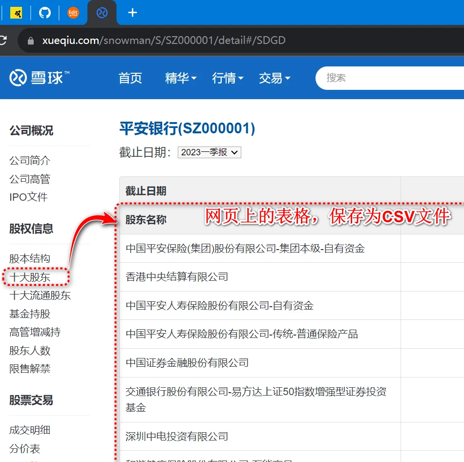
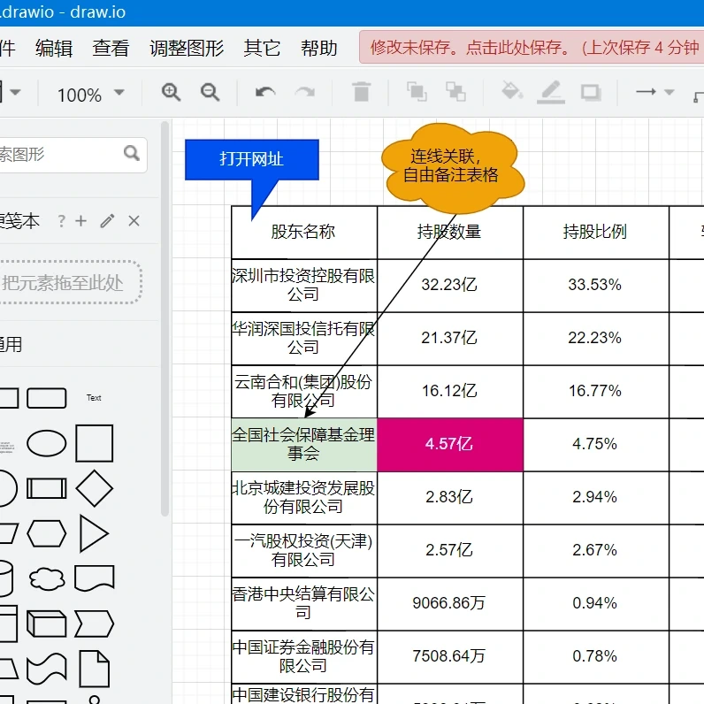

import Drawio from '@theme/Drawio'
import simpleGraph from '!!raw-loader!./drawio-graph/CY-PWA.drawio';

# 把CSV转化为drawio表格
帮您生成源代码与图形。

### 第一个应用：把CSV转化为drawio表格

## 有参数的示范
<Drawio content={simpleGraph} page={1} zoom={1} editable={true} edit={true} />
