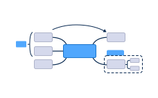

# 简介

- 名称：CY，使用Cytoscape.js开发。
- 图论，点node，点可以是图片、饼图等等。
- 图论，边edge，边可以有箭头、颜色、粗细等等。
- 按图索骥。
- 基于图论的计算，新节点由 `已有节点` 与人工智能生成。

### 用途

- 知识管理系统、笔记系统
- `战略管理` 、`预测与预言` 、 `经济预测与决策` 、`预测股价` 、 
- 自动化编程 、人工智能、
- `科学研究` 等等

### 特点

- 用Git仓库存储
- 由`.md`、`.json`、`.webp`等文件组成，每个文件类型都有大量的工具可以使用。无专有文件类型。
- `节点`与`边`的注释，链接到网址，如GitHub的Issues,比如链接到Gitea的工单，可以和EF配合使用。

### 评语

- 可以取代思维导图软件，而且还有很多额外的优点。
