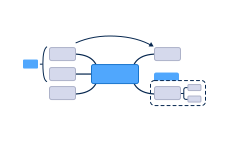

# 简介

- 名称：CY
- 使用Cytoscape.js开发。
- 图论，点node，点可以是图片、饼图等等。
- 图论，边edge，边可以有箭头、颜色、粗细等等。
- 图论，从node可以`查看与编辑`它的文件，按图索骥。
- 基于图论的计算，新节点由 `已有节点` 与人工智能生成。

## 用途：

- 知识管理系统、笔记系统
- 比思维导图更自由、更友好、更开放
- `战略管理` 、`预测与预言` 、 `经济预测与决策` 、`预测股价` 、 自动化编程 、人工智能、`科学研究`、`刑侦`等等

## 特点：

- 仓库模式（像VSCodium的文件夹模式）
- 仓库由`.md`、`.json`、`.webp`等文件组成，每个文件类型都有大量的工具可以使用
- 无专有文件类型
- 关于`节点`与`边`的注释，链接到其它网址，比如链接到GitHub的Issues,比如链接到Gitea的工单。

## 可以取代思维导图软件，而且还有额外的优点

* 优点1：分类更自由
* 优点2：支持markdown

