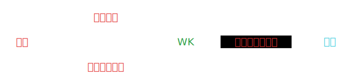

# 简介

- 手机做键盘
- 不只是键盘
- 为了帮您节省精力、节省时间

### 示意图

### 评语

:::tip
1. 用户可以自由调整按键位置。独一无二，市场上没有同类产品。
2. 功能全面，可以完全的完美的取代实体键盘（蓝牙与激光键盘）。
:::

### 使用技巧

1. 有些浏览器在若干秒内使用缓存键盘布局，如需立即生效可使用[http://IP/?=1](http://IP/?=1)（更改以上URL的数字）。
2. 支持多个手机或平板连接同一IP。这样可以有更多的视角，提高效率。

### 定制

* 定制某些软件的快捷热键合一（不用记忆快捷热键合一，节省体力与心力）
* 定制段落（某些文本或范文，反复用到，可以定制，不用再去查找、复制与粘贴）